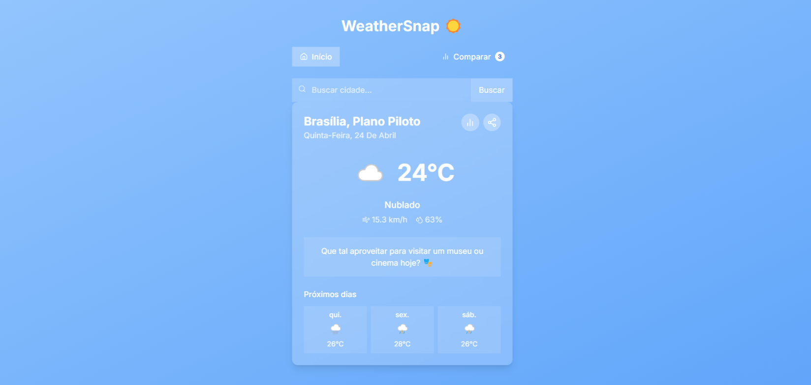
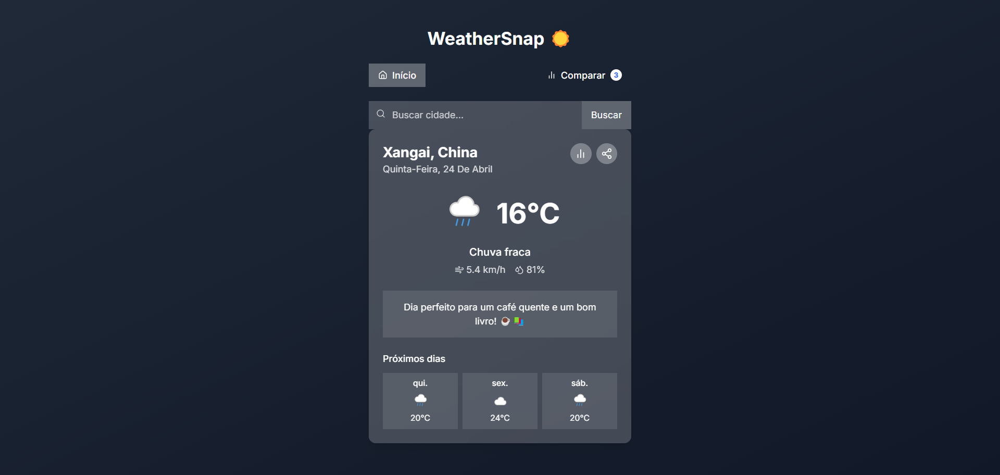

# 🌦️ WeatherSnap - App de Previsão do Tempo

O **WeatherSnap** é um projeto prático desenvolvido para exercitar habilidades fundamentais de desenvolvimento web front-end, focando em integração com APIs externas, manipulação dinâmica do DOM e design moderno.

---

## 📸 Demonstração do Design

Abaixo estão os guias visuais para o desenvolvimento da interface, utilizando conceitos de **Glassmorphism** e temas dinâmicos.

| Tema Dia | Tema Noite |
| :---: | :---: |
|  |  |

---

## 🎯 Objetivos da Atividade

*   **Consumo de APIs**: Praticar o uso de `fetch` para obter dados climáticos em tempo real.
*   **Lógica de Dados**: Manipular objetos JSON e converter unidades (temperatura, velocidade do vento, etc).
*   **Design Moderno**: Aplicar **TailwindCSS** para criar uma interface responsiva e elegante.
*   **UX/UI**: Implementar feedbacks visuais e mensagens contextuais para melhorar a experiência do usuário.

---

## 🔧 Tecnologias Utilizadas

*   **HTML5**: Estrutura semântica.
*   **TailwindCSS**: Estilização rápida e responsiva.
*   **JavaScript (ES6+)**: Lógica, manipulação de DOM e integração com API.
*   **API Open-Meteo**: (Ou alternativas como WeatherAPI / OpenWeather).

---

## 📋 Requisitos Funcionais

1.  **Consulta por Cidade**:
    *   Campo de busca funcional (clique no botão ou tecla "Enter").
    *   Exibição das condições atuais e previsão para os próximos 3 dias.
2.  **Temas Dinâmicos**:
    *   Alteração automática da interface com base na condição climática e hora do dia.
3.  **Sugestões Inteligentes**:
    *   Exibir mensagens baseadas no clima (ex: "Leve um guarda-chuva!", "Ideal para uma caminhada").
4.  **Ícones Climáticos**:
    *   Uso de SVGs ou bibliotecas (Weather Icons/Lottie) para representação visual.
5.  **Responsividade Total**:
    *   Layout adaptável para dispositivos móveis e desktop.

---

## 🚀 Como Executar o Projeto

1.  Clone este repositório.
2.  Abra o arquivo `index.html` diretamente no seu navegador ou utilize a extensão **Live Server** no VS Code.
3.  (Opcional) Se estiver usando Tailwind via CDN, certifique-se de estar conectado à internet.

---

_Este projeto faz parte de uma atividade prática de JavaScript._